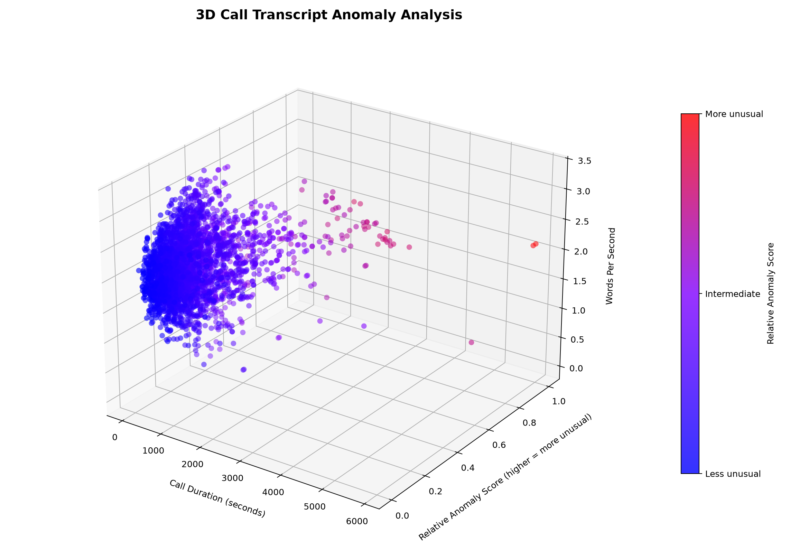
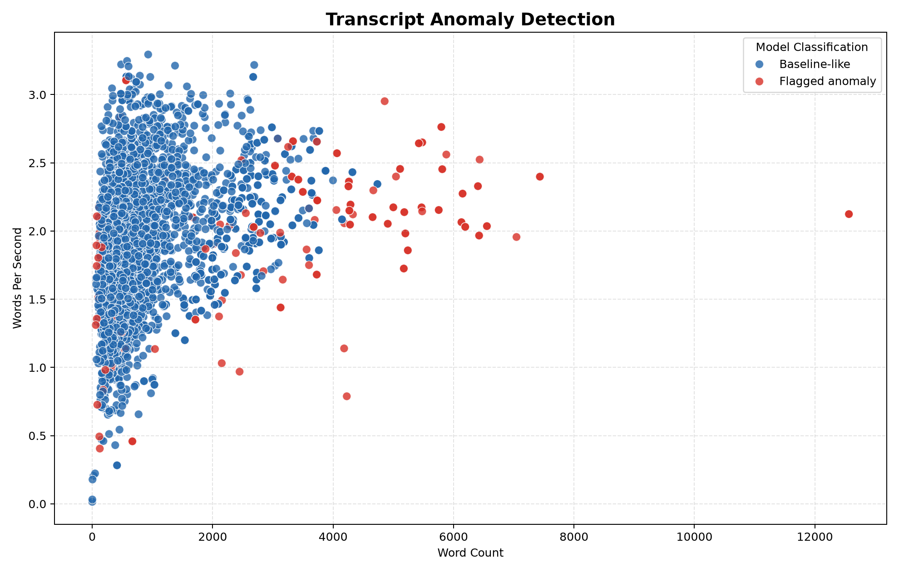

# PCLADS: Call Transcript Anomaly Detection

PCLADS is a Python research project that explores anomaly detection in call-center transcript data. It combines transcript text features with call-level statistics, then uses an Isolation Forest to flag records that differ from the dataset's learned baseline.

> **Important:** A flagged transcript is an unusual data point, not evidence of a crime. This project does not estimate guilt or provide a validated criminal-risk score. Use its results for research and human review only.

## Features

- Loads the public Parquet dataset from Hugging Face with Pandas.
- Uses transcript text and available call statistics as model inputs.
- Converts text into TF-IDF features, then reduces their dimensionality with TruncatedSVD.
- Scales numerical features and combines them with text features.
- Fits a scikit-learn Isolation Forest to identify outliers.
- Creates a 3D plot with a blue-to-purple-to-red anomaly-score gradient.
- Creates a 2D plot comparing transcript word count with speaking rate.
- Exports scores and review flags to `call_anomaly_results.csv`.

## Example outputs

The Python script saves both plots in its working directory. Run the script first, then commit the two PNG files next to this README for them to display on GitHub.

### 3D anomaly plot

- **X-axis:** Call duration in seconds
- **Y-axis:** Relative anomaly score, scaled from 0 to 1
- **Z-axis:** Words per second
- **Color:** Blue means a lower relative anomaly score, purple means an intermediate score, and red means a higher relative anomaly score.



### 2D anomaly plot

- **X-axis:** Transcript word count
- **Y-axis:** Words per second
- **Blue points:** Baseline-like according to the model
- **Red points:** Flagged as anomalies according to the selected threshold



These colors describe model output only. They do not indicate whether a conversation is criminal or harmless.

## Dataset

This project uses the **Home/Telecom Call Center Transcript Viewer V2** dataset:

- **Dataset page:** [Hugging Face dataset](https://huggingface.co/datasets/yevgeniy03/home-telecom-callcenter-transcripts-viewer)
- **File used by the script:** `data/train.parquet`
- **Language:** English
- **Records:** 3,239 transcript rows, according to the dataset card
- **Format:** Parquet
- **License listed by the dataset:** CC BY-NC 4.0

The dataset is a viewer copy of call-center transcripts. It includes the original `text` field and a `dialogue_text_inferred` field with inferred speaker roles. The dataset card states that inferred role labels are inspection aids, not ground truth.

**License note:** CC BY-NC 4.0 restricts commercial use. Review the dataset's license and source information before redistributing the data or using it in a commercial project. This repository should link to the dataset rather than republish its Parquet file.

## Validation and experimental results

The implementation was independently audited against commit `94854e0`. Full measurements, methods, and limitations are in **[reports/VALIDATION_REPORT.md](reports/VALIDATION_REPORT.md)**.

The audit changed no source code, configuration, or data. Every figure below is a measured value.

### Verified

- **Bit-for-bit reproducible.** Three independent executions produced byte-identical `call_anomaly_results.csv` and PNG files, with MD5 hashes matching the committed artifact (`e33ce973e834b4dd8289fbbd8d770bdf`).
- **Input data is essentially complete.** Across 35 columns and 3,239 rows there is **1** missing value. No NaN, infinity, or negative values in any of the 12 model features.
- **Output integrity holds.** 3,238 rows in and out; scores span `[0.3741, 0.6032]` with no nulls; `Score_01` reproduces min-max scaling to within `3.3e-16`; flags and status labels are consistent for every row.
- **The flag rate is exactly as documented.** 162 of 3,238 records = **5.003%**, at threshold `0.4837183`.
- **Random seeds are recorded and effective:** `np.random.seed(42)` plus `random_state=42` on both the SVD and the Isolation Forest.
- **The README's technical description matches the code:** TF-IDF (3,000 terms, 1–2 grams) → TruncatedSVD (30 components) → 12 numeric + 30 text features → Isolation Forest (200 trees) → 95th-percentile flag.
- **The dataset contains no ground-truth anomaly labels.** See limitations below.

### Measured findings that qualify the results

These are descriptive statistics, **not** evidence of detection accuracy.

- **The ranking is substantially a "long call" ranking.** Flagged records have a median duration of **26.9 minutes** against **5.2 minutes** for the corpus, and a median **3,422** words against **574**. Cohen's *d* (standardized gap between flagged and unflagged groups) is **1.37** for duration and **1.35** for word count, but only **0.03** for transcription confidence and **0.12** for speaking rate. Seven of the twelve features separate the two groups at "large" effect, and all seven measure call size.
- **A trivial baseline recovers much of the flagged set.** Ranking by word count alone overlaps the model's flagged set with a Jaccard index of **0.409**. The model does add information beyond length — but the headline behaviour is partly reproducible by sorting on one column.
- **No single feature dominates.** Numeric-only scoring correlates ρ = **0.675** with the full model and text-only ρ = **0.669**; the best single feature reaches only ρ = **0.454**. The ranker is a genuine multivariate blend.
- **Extreme values do not reliably produce extreme scores.** Multiplying duration and word count by 5× for 10% of rows raised their flag rate only from 4.53% to **9.26%** (synthetic stress test).
- **The dataset contains duplicate records.** 272 rows share an identical four-field numeric signature; **42 of them (25.9%)** land in the flagged set. Ranks 1 and 2 are occupied by a near-identical pair, so the top of the queue is partly redundant.
- **All speaker roles are LLM-inferred.** `role_inference_status` is `bedrock_inferred` for all 3,238 rows, so four of the twelve numeric features are model-generated labels rather than measurements.
- **The threshold is a review budget, not a detection rate.** Because the flag is a percentile of the same scores, a corpus containing no anomalies at all would still yield exactly 5% flagged. `contamination=0.05` in the script has no effect on any output, since the code uses `score_samples` and an explicit percentile rather than `predict`.
- **The score distribution is well-behaved but low-resolution.** Mean 0.4288, SD 0.0299, skewness 1.251 — right-skewed with usable dynamic range, yet a narrow spread that limits sensitivity to subtle anomalies.

### Sanitized evidence

Aggregate, non-sensitive charts and tables live in [`reports/evidence/`](reports/evidence/). No transcript text, name, phone number, or call identifier appears in the report or in any evidence file.

| File | Contents |
|---|---|
| [`score_distribution.png`](reports/evidence/score_distribution.png) | Score histogram with the p95 threshold |
| [`threshold_sensitivity.png`](reports/evidence/threshold_sensitivity.png) | Flagged-set characteristics at 1%, 3%, 5%, 10%, 20% |
| [`feature_separation.png`](reports/evidence/feature_separation.png) | Cohen's *d* per feature |
| [`flagged_vs_baseline_length.png`](reports/evidence/flagged_vs_baseline_length.png) | Flagged vs. unflagged call size |
| [`score_summary.csv`](reports/evidence/score_summary.csv) | Aggregate score statistics |
| [`top20_anomaly_aggregate_features.csv`](reports/evidence/top20_anomaly_aggregate_features.csv) | Top-20 by score, anonymized numeric aggregates only |

## How it works

1. **Load data:** Pandas reads the Parquet file directly from Hugging Face.
2. **Choose transcript text:** The script prefers `dialogue_text_inferred` and falls back to `text` when needed.
3. **Prepare numeric data:** Available features such as duration, word count, speaking rate, turn counts, and confidence fields are converted to numeric values. Missing values are imputed with the median.
4. **Represent text:** `TfidfVectorizer` creates word and bigram features. `TruncatedSVD` reduces these features to a smaller numerical representation.
5. **Combine features:** The script scales the numeric and text-derived features and joins them into one feature matrix.
6. **Detect outliers:** `IsolationForest` assigns anomaly scores. The script flags records at or above the 95th percentile of scores, which corresponds to a 5% review threshold on this run. Because the cut is a percentile of the same scores, it always selects 5% of rows; it is a review budget, not a measured anomaly rate. The `contamination=0.05` argument has no effect on the output, because the code reads `score_samples` and applies its own percentile rather than calling `predict`.
7. **Visualize and export:** Matplotlib and Seaborn generate plots, and Pandas writes the results CSV.

The current script fits and scores the same dataset. This is useful for an initial exploration, but it is not a held-out evaluation of how the model performs on new calls.

## Requirements

Use a Python environment with the following packages:

- NumPy
- Pandas
- Matplotlib
- Seaborn
- scikit-learn
- PyArrow
- fsspec
- huggingface_hub

## Installation

From the project directory, install the dependencies into the Python interpreter or virtual environment used by the project:

```bash
python -m pip install numpy pandas matplotlib seaborn scikit-learn pyarrow fsspec huggingface_hub
```

If PyCharm uses a project virtual environment, select that environment as the project's interpreter before installing packages.

## Run the project

Run the Python file containing the detector. If your current filename is `LLM(with a real simulated database).py`, use:

```bash
python "LLM(with a real simulated database).py"
```

The script downloads the Parquet data as needed and writes these outputs to the process's working directory:

```text
call_anomaly_3d.png
call_anomaly_2d.png
call_anomaly_results.csv
```

The database in this version is a public call-center transcript dataset, not a fully simulated database. The unusual examples and criminal-activity labels are not supplied by this dataset.

## Output CSV

`call_anomaly_results.csv` contains the available original columns plus the fields added by the script, including:

| Column | Meaning |
|---|---|
| `analysis_text` | Transcript text selected for analysis |
| `Anomaly_Score` | Raw outlier score transformed so larger values indicate greater unusualness |
| `Anomaly_Flag` | `-1` for flagged records and `1` for baseline-like records |
| `Status` | Human-readable label derived from the anomaly flag |
| `Score_01` | Min-max-scaled anomaly score between 0 and 1, used for the 3D color and Y-axis |

Exact column names and the available numeric features depend on the source dataset version.

## Limitations and next steps

- **No criminal-activity labels:** The dataset does not provide reliable labels for criminal versus non-criminal calls. The detector identifies outliers, not criminal activity.
- **No ground-truth evaluation yet:** Precision, recall, false-positive rate, and detection quality have not been established. They cannot be computed from this dataset at all, because no anomaly labels exist in it. The audit deliberately reports no such figures.
- **The 5% figure is a review threshold, not a detection rate:** The flag is the top 5% of scores by construction. A corpus containing no anomalies at all would still produce 162 flagged records.
- **Call length dominates the ranking:** Measured flagged-vs-corpus medians are 26.9 vs. 5.2 minutes of duration and 3,422 vs. 574 words. A long call tends to be flagged for being long, independent of its content.
- **The ranker fits and scores the same records:** There is no held-out evaluation, so nothing here demonstrates performance on unseen calls. Imputation and scaling are also fit on the full dataset.
- **Speaker roles are inferred, not measured:** All 3,238 records have `role_inference_status = bedrock_inferred`, so four of the twelve numeric features come from an LLM rather than from measurement.
- **Duplicate records are present:** 272 rows share an identical four-field numeric signature and 42 of them are flagged, so roughly a quarter of the flagged set is redundant.
- **Not an LLM:** The current version uses TF-IDF, TruncatedSVD, and Isolation Forest. It does not train or fine-tune a large language model. Note that an LLM *produced part of its input data* — the inferred speaker roles.
- **No pinned environment:** The requirements below are package names without versions, and the dataset revision is not pinned in the code. Reproducing this exact output currently requires the versions listed in the validation report.
- **No call start-time axis:** The current dataset fields used by the graph include call duration, not a verified call start timestamp. Therefore, the 3D X-axis is duration, not time of day.
- **Feature and data bias:** Unusual call lengths, speaking rates, redaction counts, transcription errors, or inferred speaker labels can affect anomaly scores.
- **Human review is necessary:** Do not use an anomaly flag alone to accuse, identify, or take action against a person. Every one of the top ten ranked anomalies is explainable as a long, duplicated, or automated-menu-heavy call.
- **Protect transcript data:** Transcripts can contain personal or sensitive information. Avoid publishing raw transcripts or exported results containing sensitive text.

## Tech stack

`Python` · `Pandas` · `NumPy` · `scikit-learn` · `Matplotlib` · `Seaborn` · `Parquet`

## Attribution

Dataset: [Home/Telecom Call Center Transcript Viewer V2](https://huggingface.co/datasets/yevgeniy03/home-telecom-callcenter-transcripts-viewer), provided under the license listed on its dataset page.
