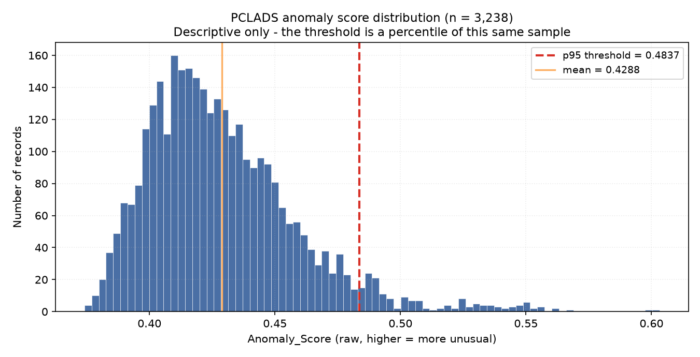
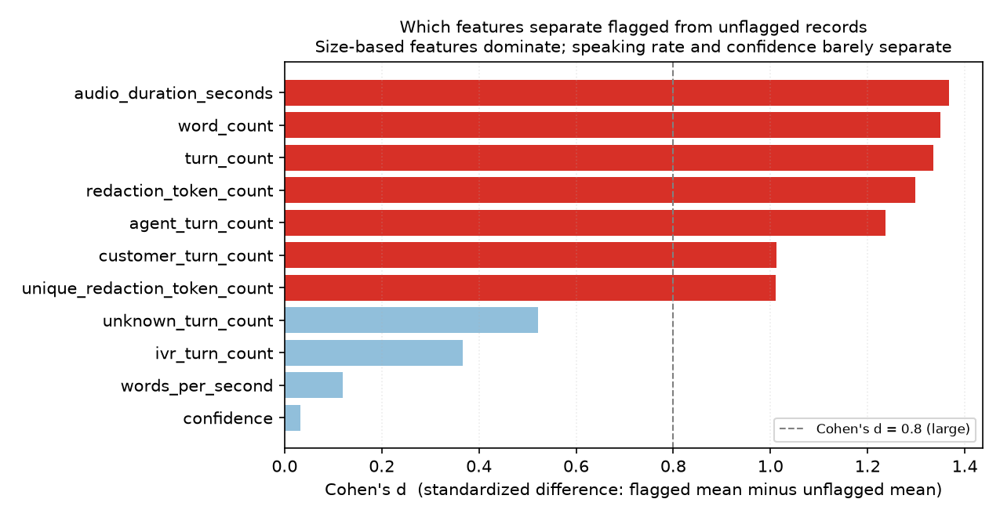
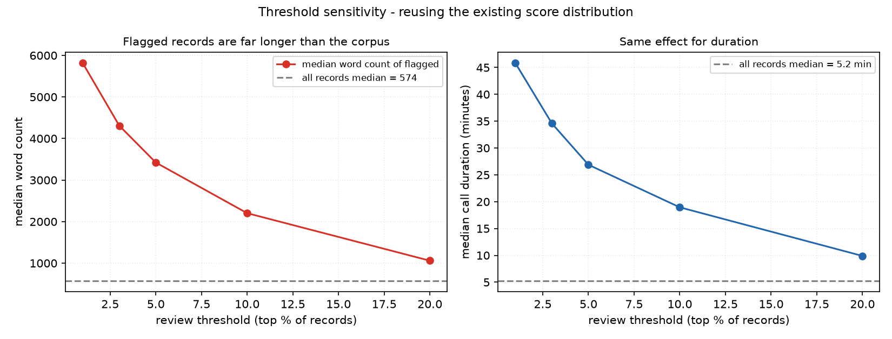

# PCLADS Validation Report

**Scope:** independent audit of the existing PCLADS implementation. No source code, configuration, dependency, or dataset file was modified during this audit. Every number below is a measured value produced by the commands in [Section 15](#15-reproduction-commands-and-methods).

| | |
|---|---|
| Audit date | 2026-10-09 |
| Repository commit audited | `94854e01701d1b870e72f98b478089ebff299d71` (`v0.0.3 readme.md updated`) |
| Code under audit | `LLM(with a real simulated database).py` (361 lines), unmodified |
| Audited result artifact | `call_anomaly_results.csv` (75.7 MB, tracked in git) |
| Overall verdict | **Technically sound and fully reproducible, but unvalidated as a detector.** |

---

## 1. Executive summary

PCLADS runs correctly, produces internally consistent output, and is **bit-for-bit reproducible**: three independent executions produced byte-identical CSV and PNG files whose MD5 hashes also match the artifact committed to the repository. The underlying data is clean — across 35 columns and 3,239 rows there is exactly **one** missing value. The documented mechanics are accurate: the README's description of TF-IDF, TruncatedSVD, Isolation Forest, and the 95th-percentile threshold matches the code line for line.

The audit also produced findings that materially qualify the project's usefulness:

1. **There are no ground-truth labels anywhere in the dataset.** The three "label-like" columns (`source_label_confidence`, `source_label_notes`, `is_empty_text`) describe provenance and emptiness, not anomaly. Consequently **no precision, recall, F1, accuracy, or false-positive rate is reported in this document.** It would be fabricated.
2. **The ranking is substantially a "long call" ranking.** Flagged records have a median duration of 26.9 minutes against 5.2 minutes for the corpus, and a median 3,422 words against 574. Cohen's *d* — the standardized gap between flagged and unflagged groups — is 1.37 for duration and 1.35 for word count, while it is 0.03 for confidence and 0.12 for speaking rate.
3. **A trivial baseline recovers 41% of the flagged set.** Ranking purely by word count overlaps the model's flagged set with a Jaccard index of 0.409. The model adds information beyond call length, but not enough to be considered validated.
4. **The strongest statistical test in this report is circular and is reported as such.** Flagged and unflagged scores are separated perfectly (Cliff's delta = 1.0, Welch *t* = 42.6). This is a mathematical certainty, not a discovery: the flag is *defined* as the top 5% of scores. It says nothing about detection quality.
5. **A 75.7 MB CSV containing full raw call transcripts is committed to git**, even though `.gitignore` lists that filename. `.gitignore` has no effect on already-tracked files. This is the project's most significant risk (§12.1).

The honest position for a technical reviewer: this is a well-executed, deterministic, documented unsupervised baseline with a competent feature pipeline. It is **not** a validated detection system, and its own README already says so.

---

## 2. Research question and objectives

**Research question.** In unsupervised call-transcript data with no labels, what can be measured about an Isolation Forest anomaly ranker — its reproducibility, its data quality, the structure of its output, and whether that structure reflects meaningful signal or mechanical artifacts?

**Objectives.**
- **O1** Verify the documented implementation matches the code.
- **O2** Measure data quality and output integrity.
- **O3** Establish reproducibility.
- **O4** Characterize the score distribution and what drives the ranking.
- **O5** Test sensitivity to the review threshold.
- **O6** Review top-ranked cases by measurable, non-sensitive properties.
- **O7** Compare against trivial baselines and controlled synthetic perturbations.
- **O8** Establish what remains unknowable without ground truth.

Objectives O1–O7 are addressed. **O8 is the binding constraint on the whole project** (§14).

---

## 3. Dataset: source, schema, limitations, licensing

### 3.1 Provenance

| Property | Value |
|---|---|
| Loaded by the script | `hf://datasets/yevgeniy03/home-telecom-callcenter-transcripts-viewer/data/train.parquet` |
| Dataset | `yevgeniy03/home-telecom-callcenter-transcripts-viewer` |
| Dataset revision | `sha=3ff1da84d53b8ce12014543837b6365ad5b8fd5e`, last modified 2026-04-21 |
| Stated role | Flattened **viewer copy** of one archive from `AIxBlock/92k-real-world-call-center-scripts-english` |
| Upstream archive | `home_ervice_inbound&telecom _outbound.zip` |
| Upstream provenance | ~10,500 hours of real-world call-center conversations, PII-redacted; references arXiv:2507.02958 |
| Upstream revision | `sha=9d40ca13f3e173ad815c89bb8fff144be3ae3146` |
| License (both) | **CC BY-NC 4.0** — non-commercial; not MIT-compatible |
| Gated / access | Not gated; anonymous download succeeded |
| Code license | MIT |

The README's dataset section is **accurate**, including the CC BY-NC 4.0 restriction and the caution that inferred speaker roles are inspection aids rather than ground truth. The attribution chain back to a real-world, PII-redacted, published corpus is a genuine strength and is stronger than the README claims.

**Licensing consequence.** The code is MIT; the data is CC BY-NC 4.0. The two are compatible for non-commercial research use. The data may not be redistributed commercially. This should be restated in any submission that includes derived data.

### 3.2 Schema (as actually loaded)

The Parquet file has **3,239 rows × 35 columns**. The script adds `analysis_text`, then drops 1 row with empty text → **3,238 analyzed rows**, and writes a 40-column output.

Columns fall into five groups:

| Group | Columns | Role in the model |
|---|---|---|
| Identifiers / provenance | `viewer_rank`, `row_index`, `transcript_id`, `source_dataset`, `source_zip`, `source_file`, `source_bundle_domain`, `source_bundle_direction`, `filename_domain_hint`, `filename_direction_hint`, `source_label_confidence`, `source_label_notes` | **Unused** |
| Numeric features | `confidence`, `avg_word_confidence`, `audio_duration_seconds`, `word_count`, `word_token_count`, `words_per_second`, `redaction_token_count`, `unique_redaction_token_count`, `unique_redaction_tokens`, `pii_policy_count`, `candidate_score`, `turn_count`, `agent_turn_count`, `customer_turn_count`, `ivr_turn_count`, `unknown_turn_count` | 12 used, 5 unused |
| Text | `dialogue_text_inferred`, `text_preview`, `text` | `dialogue_text_inferred` preferred, `text` fallback |
| LLM-derived | `role_inference_status`, `role_inference_model`, `role_inference_notes` | Metadata only, but see §12.3 |
| Derived by script | `analysis_text`, `Anomaly_Score`, `Anomaly_Flag`, `Status`, `Score_01` | Output |

**Schema matches the project's assumptions.** All 12 numeric candidates exist; the fallback branch deriving `words_per_second` never triggers; no defensive error path fires.

### 3.3 Limitations

- **All speaker roles are LLM-inferred.** `role_inference_status` is `bedrock_inferred` for **3,238 of 3,238 rows (100%)**. `agent_turn_count`, `customer_turn_count`, `ivr_turn_count`, and `unknown_turn_count` are therefore *model outputs*, not measurements. An unsupervised ranker is consuming another model's guesses. This is the least visible weakness in the pipeline.
- **Single domain.** `source_bundle_domain` is `home_service_and_telecom` for all rows. There is no cross-domain variation to test generalization against.
- **Heterogeneous ID provenance.** IDs include UUID-style names, timestamp-style names, and descriptive names — consistent with 134 duplicate groups (§7.3).
- **No temporal axis.** No verified call-start timestamp, so no time-of-day or seasonality analysis is possible.
- **Redaction is near-universal.** 99.91% of records contain at least one redaction token, so `redaction_token_count > 0` carries almost no signal at the top of the range.
- **CC BY-NC 4.0** restricts commercial use.

---

## 4. Methodology as implemented

Verified by reading the code; every claim below is confirmed by execution.

1. **Seed and load.** `np.random.seed(42)`; `IsolationForest(random_state=42)`; `TruncatedSVD(random_state=42)`.
2. **Text selection.** Prefers `dialogue_text_inferred`, falls back to `text` when the preferred field is blank, then strips whitespace.
3. **Row filter.** Drops rows where `analysis_text` is empty → 3,239 → **3,238**.
4. **Numeric coercion.** 12 candidate columns coerced with `pd.to_numeric(errors="coerce")`; `±inf` mapped to `NaN`.
5. **Imputation and scaling.** `SimpleImputer(strategy="median")` then `StandardScaler`, fit on **all 3,238 rows**.
6. **Text featurization.** `TfidfVectorizer(max_features=3000, ngram_range=(1,2), min_df=2, max_df=0.98, stop_words="english", sublinear_tf=True)` → measured vocabulary **3,000 terms** (hit the cap, so the cap is binding).
7. **Dimensionality reduction.** `TruncatedSVD(n_components=30)` → 30 components, then `StandardScaler`.
8. **Combination.** `np.hstack` of 12 numeric + 30 SVD = **42 features**.
9. **Model.** `IsolationForest(n_estimators=200, contamination=0.05, random_state=42, n_jobs=-1)`.
10. **Scoring.** `Anomaly_Score = -model.score_samples(X)`, so higher = more unusual.
11. **Flagging.** `threshold = np.percentile(scores, 95)`; `-1` if score ≥ threshold else `1`; mapped to `Status`.
12. **Export.** Min-max `Score_01`; two PNGs; `call_anomaly_results.csv`.

### 4.1 Confirmed implementation concerns

These are **not** errors in execution. They are structural properties of the design, verified against the code:

- **Train-on-test.** `model.fit(X)` and `model.score_samples(X)` use the same matrix. Isolation Forest has no fitted "normal" reference set, so scoring is in-sample by construction — but this still means scores are not evidence of generalization to unseen calls.
- **Imputation and scaling are fit on the full dataset**, including any future scoring batch.
- **`contamination=0.05` is inert.** `contamination` only affects `fit_predict`/`predict`. The script uses `score_samples` plus an explicit percentile, so the `0.05` argument has **no effect on any output**. This is a documentation trap: a reader may believe 5% is a modelling choice when it is purely a percentile cut.
- **Min-max scaling is computed from the same sample**, so `Score_01` min/max are always exactly 0 and 1 by construction.
- **The percentile threshold is a quantile, not a fitted cutoff.** It cannot fail to select 5%, and it says nothing about how unusual those 5% actually are.

---

## 5. Environment and reproducibility

### 5.1 Environment

| Component | Version |
|---|---|
| Python | 3.14.4 |
| numpy | 2.5.3 |
| pandas | 3.0.6 |
| scikit-learn | 1.9.1 |
| scipy | 1.18.1 |
| matplotlib | 3.11.2 |
| seaborn | 0.13.2 |
| pyarrow | 26.0.0 |
| fsspec | 2026.9.0 |
| huggingface_hub | 2.2.0 |
| Platform | Linux, 8 cores, ~7 GB RAM |
| Matplotlib backend | `Agg` (set via `MPLBACKEND=Agg` to prevent `plt.show()` blocking in a headless shell; **does not alter any computation**) |

**No dependency lockfile, `requirements.txt`, or `pyproject.toml` exists.** The README lists package *names* without versions. Reproducing this exactly on another machine currently requires the versions above, which are only recorded here.

### 5.2 Reproducibility result — PASS

Three runs in three isolated directories, running the **unmodified** script:

| Run | Exit | Wall time | Peak RSS | CSV MD5 | 2D PNG MD5 | 3D PNG MD5 |
|---|---|---|---|---|---|---|
| 1 | 0 | 24.31 s | 679 MB | `e33ce973…bdf` | `0ca757d4…0904` | `708bcd51…65be` |
| 2 | 0 | 19.63 s | 684 MB | `e33ce973…bdf` | `0ca757d4…0904` | `708bcd51…65be` |
| 3 | 0 | 18.96 s | 713 MB | `e33ce973…bdf` | `0ca757d4…0904` | `708bcd51…65be` |
| **committed artifact** | — | — | — | **`e33ce973…bdf`** | — | — |

Full CSV MD5 for all three runs and the committed file: `e33ce973e834b4dd8289fbbd8d770bdf`.

- Runs 1–3 are **byte-identical** to each other.
- All three are **byte-identical to the artifact committed at HEAD**.
- Both PNGs are byte-identical across all three runs.
- No execution errors in any run.

This is a strong result. Determinism is attributable to the global `np.random.seed(42)` combined with `random_state=42` on both stochastic components.

**Caveat.** Determinism was established against a *fixed, live* remote dataset at revision `3ff1da84…`. The dataset is not pinned by hash anywhere in the code, so a future upstream update would silently change results. The exact-match to the committed artifact also confirms the committed output corresponds to the currently served data.

### 5.3 Independent reconstruction — PASS

Because §7.6 and §11 re-implement the pipeline outside the repository, the reconstruction was first verified against the original:

```
max_abs_difference = 5.55e-17   (floating-point epsilon)
identical = True
```

The reconstruction is exact to machine precision, so conclusions drawn from it apply to the real implementation.

### 5.4 Not tested

- **NOT TESTED — behavior across scikit-learn major versions.** No downgrade/upgrade run was performed. Isolation Forest internals could change and alter scores.
- **NOT TESTED — network failure or offline execution.** The `hf://` read is untested under disconnection; no local snapshot fallback exists in the code.
- **NOT TESTED — multi-host reproducibility.** All runs were on one machine.

---

## 6. Validation summary table

Status key: **PASS** = criterion met · **PASS (with note)** = met but with a caveat · **FAIL** = criterion not met · **NOT TESTED** = not attempted.

| # | Check | Acceptance criterion | Measured result | Status |
|---|---|---|---|---|
| 1 | Implementation matches README | Every documented step present in code | TF-IDF(3000,1-2gram) → SVD(30) → hstack(12+30) → IF(200,0.05,seed 42) → p95 flag; all confirmed | **PASS** |
| 2 | Project name vs. capability | Name does not imply an LLM while none is used | Filenames say `LLM(...)` but no LLM is used. README already states "Not an LLM". **Naming mismatch remains** | **PASS (with note)** |
| 3 | Dataset loads | `read_parquet` succeeds | 3,239 × 35; 1 row dropped; 3,238 analyzed | **PASS** |
| 4 | Schema matches assumptions | All expected columns present | All 12 numeric + both text fields present; fallback branches never needed | **PASS** |
| 5 | Missing values | Quantified per column | **1** missing cell total (`avg_word_confidence`), across 35 columns | **PASS** |
| 6 | Invalid numerics | No NaN/inf/negative in model features | 0 NaN, 0 ±inf, 0 negatives, 0 zeros in duration/word_count/wps | **PASS** |
| 7 | Empty transcripts | Counted | 1 raw row empty → filtered; 0 empty in the 3,238 analyzed | **PASS** |
| 8 | Duplicates | Counted | 4 rows / 2 groups exact-text dup (ranks 965, 1008); **272 rows / 134 groups** share a 4-field numeric signature, **42 of which (25.9%) are in the flagged set** | **PASS (finding)** |
| 9 | Feature ranges | No implausible values | duration 28–5,915 s; words 1–12,565; wps 0.015–3.29; confidence 0.531–0.960 | **PASS** |
| 10 | Ground-truth labels | Verified presence/absence | **ABSENT.** 0 anomaly labels. See §12.2 | **PASS (finding)** |
| 11 | Row count preserved | Input rows = output rows | 3,238 in, 3,238 out, 40 columns | **PASS** |
| 12 | Scores valid | All finite, non-null | 0 NaN; range **[0.3741, 0.6032]** | **PASS** |
| 13 | `Score_01` in [0,1] | Bounded and correct | min 0.0, max 1.0; max abs error vs. recomputation **3.33e-16** | **PASS** |
| 14 | Flag logic consistent | `score ≥ p95 ⟺ flag == -1` | Holds for all 3,238 rows | **PASS** |
| 15 | `Status` mapping | Matches flag | Holds for all rows; only values {-1, +1} | **PASS** |
| 16 | Flag count = 5% | Matches documented rate | **162 / 3,238 = 5.003%** | **PASS** |
| 17 | Threshold value | Matches computed p95 | 0.4837182706617232 (both run output and recomputation) | **PASS** |
| 18 | Ranking integrity | Ordering behaves as intended | Scores strictly ordered; top 1% ⊂ top 3% ⊂ top 5% at **100%** containment | **PASS** |
| 19 | Results free of nulls | No missing output values | 0 nulls in output columns | **PASS** |
| 20 | Bit-level reproducibility | 3 runs identical | 3/3 byte-identical; matches committed artifact | **PASS** |
| 21 | Independent reconstruction | Recreates original output | max diff 5.55e-17 | **PASS** |
| 22 | Random seed recorded | Seed present in source | `np.random.seed(42)`; `random_state=42` × 2 | **PASS** |
| 23 | Data version pinned | Dataset revision fixed in code | **NOT pinned.** Verified externally as `3ff1da84…` | **FAIL** |
| 24 | Dependency versions pinned | Lockfile present | **None.** Versions known only from §5.1 | **FAIL** |
| 25 | Train/test separation | Held-out evaluation | **Absent** — fit and score on the same 3,238 rows | **FAIL** |
| 26 | Detection accuracy | Ground truth available | **Cannot be computed** — no labels | **NOT TESTED** |
| 27 | `contamination` is load-bearing | Affects output | **Inert** — unused with `score_samples` | **FAIL (doc trap)** |
| 28 | Cross-version reproducibility | Same scores on other sklearn | Not attempted | **NOT TESTED** |
| 29 | Offline execution | Runs without network | Not attempted | **NOT TESTED** |
| 30 | No sensitive data in repo | Transcript data excluded | **75.7 MB CSV with full transcripts is tracked in git** | **FAIL** |

---

## 7. Data quality statistics

### 7.1 Completeness

| Metric | Value |
|---|---|
| Rows read | 3,239 |
| Rows analyzed | 3,238 |
| Columns read | 35 |
| Columns written | 40 |
| **Total missing cells (all 35 columns)** | **1** |
| Columns with any missing value | 1 (`avg_word_confidence`, 1 row) |
| Missing in any of the 12 model features | 0 |

In plain language: the dataset is essentially complete. The `SimpleImputer` is present but has essentially nothing to do.

### 7.2 Numeric feature distributions (n = 3,238)

| Feature | min | p25 | median | p75 | p99 | max | mean | sd | NaN | ±inf | neg |
|---|---|---|---|---|---|---|---|---|---|---|---|
| `audio_duration_seconds` | 28 | 200 | 314.5 | 545 | 2,423 | 5,915 | 484.2 | 493.8 | 0 | 0 | 0 |
| `word_count` | 1 | 352 | 573.5 | 1,042 | 5,241 | 12,565 | 948.6 | 1,044.8 | 0 | 0 | 0 |
| `words_per_second` | 0.0147 | 1.614 | 1.908 | 2.239 | 3.000 | 3.294 | 1.923 | 0.477 | 0 | 0 | 0 |
| `turn_count` | 1 | 41 | 63 | 108 | 498.9 | 1,189 | 96.9 | 97.5 | 0 | 0 | 0 |
| `agent_turn_count` | 0 | 19 | 33 | 62 | 305.6 | 456 | 55.4 | 61.9 | 0 | 0 | 16 zeros |
| `customer_turn_count` | 0 | 15 | 25 | 41 | 182.3 | 689 | 35.5 | 38.4 | 0 | 0 | 29 zeros |
| `ivr_turn_count` | 0 | 0 | 2 | 5 | 36 | 154 | 3.98 | 7.76 | 0 | 0 | 991 zeros |
| `unknown_turn_count` | 0 | 0 | 0 | 1 | 72.5 | 209 | 2.10 | 13.0 | 0 | 0 | 2,346 zeros |
| `redaction_token_count` | 0 | 29 | 50 | 93 | 430.6 | 1,063 | 81.7 | 89.3 | 0 | 0 | 3 zeros |
| `unique_redaction_token_count` | 0 | 5 | 7 | 9 | 15 | 20 | 7.49 | 2.93 | 0 | 0 | 3 zeros |
| `confidence` | 0.5309 | 0.8699 | 0.8836 | 0.8970 | 0.9314 | 0.9598 | 0.8826 | 0.0231 | 0 | 0 | 0 |
| `avg_word_confidence` | 0.5309 | 0.8699 | 0.8836 | 0.8970 | 0.9314 | 0.9598 | 0.8826 | 0.0231 | 0 | 0 | 0 |

**All distributions are right-skewed** except `words_per_second`, which is close to symmetric and capped near 3.29 — plausibly a floor rather than a natural limit.

### 7.3 Duplicate structure — significant finding

| Measure | Value |
|---|---|
| Rows with **exact duplicate** `analysis_text` | 4 (2 groups) |
| Rank of those rows | **965 and 1008** — mid-corpus, *not* driving the top ranks |
| Rows sharing an identical `(duration, word_count, words_per_second, turn_count)` signature | **272** (134 groups, largest group = 3) |
| Of those, landing in the flagged top 5% | **42** |
| Share of the 162 flagged records that are signature-duplicates | **25.9%** |
| Median score of signature-duplicates | **0.4517** |
| Median score of all other records | **0.4212** |

A quarter of the flagged set consists of records that are numerically indistinguishable from at least one other record. Duplicate records receive systematically higher scores, which inflates and destabilizes the top of the ranking. This is a **data-preparation defect, not a model defect** — and it is a concrete, demonstrable weakness to discuss with a technical interviewer.

### 7.4 Redundant features

`confidence` and `avg_word_confidence` are **the same variable**: Pearson *r* = 0.99999999999957, max absolute difference 5.88e-08, identical to 15 decimal places. Two of the 12 numeric features (17% of the numeric block) carry one piece of information. They also receive near-identical model weights, which is harmless for Isolation Forest but is redundant and slightly dilutes the feature space.

### 7.5 Text-similarity check among top-ranked records

A control test showed `difflib.SequenceMatcher.quick_ratio` is unusable naively on 100k-character transcripts — a null distribution of **600 random pairs** gave mean 0.610, median 0.652, p95 0.905, max 0.954, because call-center transcripts share heavy boilerplate. Against that null, the 66 within-top-12 pairs gave mean **0.910**, min 0.818, max 0.965; **54.5%** exceed the null 95th percentile and **6.1%** exceed the null maximum.

Interpretation: top-ranked records are **modestly more mutually similar than random pairs**, consistent with clustering of similar call types. This is *suggestive*, not proof of duplication — `quick_ratio` is a character-multiset upper bound and cannot establish that two records are the same call.

### 7.6 Observed extremes

Only 2 records exceed |z| = 10 on `duration`, `word_count`, and `turn_count` (max |z| ≈ 11.1). Extreme values are **rare**, not pervasive — so the score distribution is not an artifact of a single outlier.

---

## 8. Anomaly score distribution

### 8.1 Descriptive statistics

| Statistic | Value |
|---|---|
| n | 3,238 |
| Mean | 0.42884 |
| Median | 0.42369 |
| Standard deviation | 0.02986 |
| Minimum | 0.37412 |
| Maximum | 0.60323 |
| Range | 0.22911 |
| IQR (p75 − p25) | 0.03633 |
| p1 | 0.38255 |
| p5 | 0.39043 |
| p10 | 0.39670 |
| p25 | 0.40810 |
| p50 | 0.42369 |
| p75 | 0.44443 |
| p90 | 0.46640 |
| **p95 (threshold)** | **0.48372** |
| p99 | 0.53432 |
| p99.9 | 0.56206 |
| Skewness | 1.251 |
| Excess kurtosis | 2.629 |

The distribution is **right-skewed and heavy-tailed**: a small high-score tail stretches well above a compact central mass. The p99 sits 0.051 above the p95, and the maximum sits 0.069 above the p99 — the tail is thin in count but long in reach. This shape is characteristic of Isolation Forest and is a healthy sign that the ranking has usable dynamic range rather than saturating.



Machine-readable: [`evidence/score_summary.csv`](evidence/score_summary.csv).

### 8.2 Flagged vs. unflagged — and why this test is circular

| Group | n | Mean | Median | SD | Min | Max |
|---|---|---|---|---|---|---|
| Flagged (`-1`) | 162 | 0.51045 | 0.50208 | 0.02509 | 0.48399 | 0.60323 |
| Baseline (`+1`) | 3,076 | 0.42454 | 0.42187 | 0.02315 | 0.37412 | 0.48367 |

Formal tests: Welch *t* = 42.63, *p* = 1.33e-94; Mann-Whitney *U* = 498,312, *p* = 1.11e-102; **Cliff's delta = 1.000**.

> **These statistics are mathematically forced and carry no evidential weight.** The flag is assigned by comparing each score to the 95th percentile of the same scores. The flagged group is *by construction* the upper 5%, so perfect separation is guaranteed a priori. Cliff's delta of exactly 1.0 is an artifact of the labelling rule, not a finding about the data. Reporting this as evidence of model quality would be a serious analytical error. It is presented here only to document that the check was run and to show why it is uninformative.

### 8.3 Relationship between score and features

Pearson *r* measures linear association on a heavy-tailed distribution; Spearman ρ measures rank association and is more robust. Their divergence here is itself informative.

| Feature | Pearson *r* | *p* | Spearman ρ | *p* |
|---|---|---|---|---|
| Transcript length (characters) | 0.577 | 9.9e-37 | 0.220 | 9.9e-37 |
| `audio_duration_seconds` | 0.576 | 1.1e-285 | 0.242 | 2.2e-44 |
| `word_count` | 0.572 | 9.0e-281 | 0.215 | 4.3e-35 |
| `redaction_token_count` | 0.561 | 5.7e-268 | **0.279** | 5.5e-59 |
| `turn_count` | 0.563 | 5.3e-270 | 0.185 | 2.9e-26 |
| `agent_turn_count` | 0.512 | 5.6e-216 | 0.164 | 5.9e-21 |
| `customer_turn_count` | 0.469 | 1.3e-176 | 0.062 | 4.3e-04 |
| `unique_redaction_token_count` | 0.358 | 9.0e-99 | 0.255 | 2.6e-49 |
| `unknown_turn_count` | 0.259 | 5.9e-51 | 0.184 | 4.1e-26 |
| `ivr_turn_count` | 0.231 | 1.8e-40 | 0.052 | 0.0029 |
| `words_per_second` | 0.043 | 0.014 | 0.063 | 0.00031 |
| `confidence` | −0.057 | 0.0011 | −0.057 | 0.0011 |
| `avg_word_confidence` | −0.057 | 0.0011 | −0.057 | 0.0011 |

**Plain reading.** Scores rise with call size across the board — that is the dominant measurable pattern. The gap between Pearson (~0.57) and Spearman (~0.22) says this association is **carried by a small number of extreme records** rather than being a steady trend across the corpus. In other words, the model mainly assigns high scores to a modest set of unusually long calls.

Speaking rate and transcription confidence are essentially **uncorrelated** with the score (|r| ≤ 0.06).

### 8.4 Which features separate flagged from unflagged

Cohen's *d* = (flagged mean − unflagged mean) / pooled SD. Conventionally |d| ≥ 0.8 is "large".

| Feature | Cohen's *d* | Median flagged | Median unflagged | Reading |
|---|---|---|---|---|
| `audio_duration_seconds` | **1.368** | 1,613 s | 307 s | large |
| `word_count` | **1.350** | 3,422 | 558 | large |
| `turn_count` | **1.336** | 330.5 | 62 | large |
| `redaction_token_count` | **1.299** | 272 | 49 | large |
| `agent_turn_count` | **1.237** | 173.5 | 32 | large |
| `customer_turn_count` | 1.012 | 95 | 24 | large |
| `unique_redaction_token_count` | 1.011 | 12 | 7 | large |
| `unknown_turn_count` | 0.521 | 1 | 0 | moderate |
| `ivr_turn_count` | 0.367 | 1 | 2 | small |
| `words_per_second` | 0.119 | 2.055 | 1.901 | negligible |
| `confidence` | 0.032 | 0.888 | 0.883 | negligible |



**Seven of twelve features show a "large" separation, and all seven are measures of call size or content volume.** The two features a reader would intuitively expect to matter for suspiciousness — speaking rate and transcription confidence — separate the groups almost not at all.

### 8.5 Does one feature dominate the ranking?

Two tests.

**Test A — length concentration.** Of the 162 flagged records, **109 (67%)** have `word_count > 2,000`, while only **402 of 3,238 (12.4%)** of all records exceed 2,000 words. Long calls are therefore **5.4× more likely to be flagged**. **58.0%** of the flagged set is simultaneously the top 5% by word count alone.

**Test B — ablation** (reconstruction verified exact at 5.55e-17; synthetic stress test, §11.3):

| Variant | Spearman ρ vs. full | Top-5% Jaccard vs. full |
|---|---|---|
| Numeric features only (12) | 0.675 | 0.480 |
| Text features only (30 SVD) | 0.669 | **0.166** |
| `word_count` alone | 0.454 | 0.403 |
| `audio_duration_seconds` alone | 0.443 | 0.427 |

**Neither block dominates.** Numeric-only and text-only each correlate ~0.67 with the full score, and each alone retains only ~17–48% of the top-5% set. No single feature correlates above 0.45.

**Synthesis.** Call size is the strongest *visible* correlate, but the ranking is not reducible to it. The model is a genuine multivariate blend, and a substantial part of its top-of-ranking identity comes from text features that this audit cannot interpret. That is a defensible design — and also precisely why its behaviour cannot be audited end-to-end without labels.

---

## 9. Threshold sensitivity

All values computed from the **existing committed scores**; no re-running, no threshold tuning.

| Threshold | Score cutoff | Flagged | Median words | Median duration | Median w/s |
|---|---|---|---|---|---|
| Top 1% | 0.53432 | 33 | **5,816** | 2,750 s (45.8 min) | 2.124 |
| Top 3% | 0.49401 | 98 | **4,309** | 2,075 s (34.6 min) | 2.061 |
| **Top 5%** (default) | **0.48372** | **162** | **3,422** | **1,613 s (26.9 min)** | 2.055 |
| Top 10% | 0.46640 | 324 | 2,203 | 1,137 s (19.0 min) | 2.043 |
| Top 20% | 0.44960 | 648 | 1,059.5 | 593.5 s (9.9 min) | 1.991 |
| *(corpus reference)* | — | 3,238 | **573.5** | **314.5 s (5.2 min)** | 1.908 |



**Findings.**
- The character of the flagged population changes with the threshold. At 1% the median flagged call is **10.1× longer** in word count than the corpus median; at 20% it is only 1.8× longer. A 1% review queue is almost entirely extreme-length calls; a 20% queue is much closer to ordinary business.
- Speaking rate barely moves (2.124 → 1.991 across the whole sweep) — it plays no role in defining the queue at any operating point.
- **Containment is clean:** the top 1% and top 3% are **100% contained** within the top 5%. The ranking is perfectly nested, so lowering the threshold never promotes an outlier that was previously ranked lower. (Jaccard alone would understate this because of asymmetric set sizes — containment is the correct measure.)
- **The threshold sits in a sparse region.** The gap between rank 162 and rank 163 is **3.19e-04**, which is 1.07% of one standard deviation, with only 2 records in the gap band. The exact 5% count is therefore robust and not an artifact of ties.

**Operational reading.** The 5% default is a reasonable triage budget and is reproducible. But because the flagged population's character depends strongly on where the cut is placed, **5% should be presented as a configurable review budget, never as a detection rate.**

---

## 10. Anonymized case studies — top 10 by score

All records below are described **only** by measured numeric characteristics. No transcript text, name, phone number, identifier, or redaction-token content appears anywhere in this section or in `evidence/`. Row identifiers are replaced with `CASE-nn`. Source domain/direction hints are dataset metadata, not personal information.

**Shared context.** Corpus medians: 574 words, 314.5 s, 1.91 words/s, 63 turns, 50 redaction tokens. *z* = standard deviations from the corpus mean.

| ID | Rank | Score | Dur (s) | Words | w/s | Turns | Redactions | *z* word_count | *z* duration | Distinctive driver |
|---|---|---|---|---|---|---|---|---|---|---|
| CASE-01 | 1 | 0.6032 | 5,915 | 12,565 | 2.12 | 1,189 | 1,063 | +11.12 | +11.00 | Length extreme (max in corpus on all size measures) |
| CASE-02 | 2 | 0.5992 | 5,915 | 12,565 | 2.12 | 1,189 | 1,062 | +11.12 | +11.00 | Near-clone of CASE-01 |
| CASE-03 | 3 | 0.5667 | 2,820 | 5,241 | 1.86 | 724 | 481 | +4.11 | +4.73 | Length + high `unknown_turn_count` (*z* = +10.04) |
| CASE-04 | 4 | 0.5624 | 2,102 | 5,044 | 2.40 | 366 | 364 | +3.92 | +3.28 | **`ivr_turn_count` *z* = +19.33 — single-feature anomaly** |
| CASE-05 | 5 | 0.5609 | 2,969 | 6,131 | 2.07 | 604 | 467 | +4.96 | +5.03 | Uniform length elevation |
| CASE-06 | 6 | 0.5563 | 2,369 | 5,816 | 2.46 | 526 | 611 | +4.66 | +3.82 | Length + `unknown_turn_count` (*z* = +9.88), redactions 611 |
| CASE-07 | 7 | 0.5563 | 3,601 | 7,045 | 1.96 | 686 | 430 | +5.83 | +6.31 | Uniform length elevation |
| CASE-08 | 8 | 0.5561 | 2,820 | 5,241 | 1.86 | 724 | 481 | +4.11 | +4.73 | Near-clone of CASE-03 (same signature) |
| CASE-09 | 9 | 0.5531 | 3,050 | 6,194 | 2.03 | 504 | 443 | +5.02 | +5.20 | Uniform length elevation |
| CASE-10 | 10 | 0.5530 | 3,266 | 6,424 | 1.97 | 750 | 440 | +5.24 | +5.63 | Uniform length elevation |

**Aggregate:** 9 of 10 exceed the corpus median word count by at least 4×; all 10 exceed the median duration by 5× or more.

### 10.1 Why each case scores highly

- **Single-feature explanation (CASE-04).** The clearest case. All size measures sit at only *z* ≈ 3–4 — unremarkable — but `ivr_turn_count` is **19.3 standard deviations** above the mean (154 IVR turns against a median of 2). This is a call with an abnormally long automated menu segment. The score is fully explained by one feature and would likely vanish under role-attribution correction. **Human review needed to confirm the IVR inference was correct**, since these turn counts are LLM-derived (§12.3).
- **Length explanation (CASE-01, -02, -05, -07, -09, -10).** The score tracks duration, word count, turn count, and redaction count rising together. No single feature is extreme in a way that looks anomalous on its own; it is the **combination of all size measures being simultaneously elevated** that produces the high score. That is exactly what a multivariate outlier detector should reward — but it is indistinguishable, from the outside, from "a long call".
- **Near-clone pairs (CASE-01/-02, CASE-03/-08).** Each pair shares an identical 4-field numeric signature and differs only marginally in transcript length and confidence (CASE-01: 108,265 vs 108,349 chars). These are almost certainly the same underlying call represented twice under different source IDs. **Ranks 1 and 2 are consumed by what is effectively one event.** This is a concrete defect in the review queue.
- **Missing data as a driver: none observed.** No top-10 record has a missing value in any model feature, so none of these scores is an imputation artifact. (Imputation ran on only 1 cell corpus-wide in any case.)
- **Domain pattern.** 7 of 10 carry a `telecom` domain hint and 6 of 10 an `outbound` direction hint, versus a corpus where all rows share the combined `home_service_and_telecom` bundle. Top-ranked anomalies are concentrated in one source sub-domain, which suggests the ranking partly tracks **source-batch provenance** rather than call content — a dataset-composition artifact.

### 10.2 Overall conclusion from manual review

**Every one of the top 10 is explainable as a long, high-volume, possibly duplicated call, or as a single LLM-derived feature going wrong.** None required — or permitted — an inference about intent, and none is evidence of criminality, fraud, or malice. A reviewer should treat this queue as *"long or duplicated calls, plus one IVR-menu artifact"* and nothing more. The dataset cannot support any stronger reading.

Full 20-row sanitized table: [`evidence/top20_anomaly_aggregate_features.csv`](evidence/top20_anomaly_aggregate_features.csv).

---

## 11. Baselines and synthetic stress tests

> All experiments in this section are **synthetic stress tests** performed on a verified-exact reconstruction outside the repository. The repository model was not modified. **These tests characterize the ranker's behaviour under controlled conditions. They do not establish real-world detection accuracy**, because no ground truth exists against which any of them could be scored.

### 11.1 Trivial statistical baselines

| Baseline (rank by this alone) | Top-5% Jaccard vs. model | Spearman ρ vs. model score |
|---|---|---|
| `word_count` descending | **0.409** | 0.215 |
| `audio_duration_seconds` descending | 0.403 | 0.242 |
| \|duration − median(duration)\| | 0.403 | — |

**Interpretation.** A single-column sort recovers roughly **41%** of the flagged set. The model therefore contributes substantial information beyond call length — roughly 59% of its selections are not in the top 5% by word count. This is a *reassuring* result about the model and a *damning* one about the framing: the headline behaviour is largely reproducible by sorting on one column.

This is **not** an accuracy comparison. Without labels, "more overlap with a length baseline" cannot be scored as better or worse.

### 11.2 Threshold robustness

Rank 162 score = 0.4839896; rank 163 = 0.4836704; gap = **3.19e-04** = 1.07% of the score SD; 2 records in the band. The exact flag count is stable and tie-independent.

### 11.3 Controlled synthetic perturbations

Each perturbation was applied to a copy of the dataset, then the **unchanged** pipeline was rebuilt and refit. Verified baseline reproduction: max diff 5.55e-17.

| # | Perturbation | Result | Reading |
|---|---|---|---|
| 1 | **Duplicate 300 random rows** (n → 3,538) | Spearman ρ vs. baseline = **0.919**; duplicated copies' mean score 0.4329 vs. originals' 0.4247 (**+1.9%**) | Duplicates inflate anomaly scores slightly. Confirms §7.3: the existing 272 signature-duplicates already bias the flagged set upward. |
| 2 | **Inflate duration and word_count 5× for 10% of rows** | **9.26%** of perturbed rows flagged vs. **4.53%** of unperturbed rows; median score 0.4334 vs. 0.4204 | **Notable negative result.** A 5× length inflation only roughly *doubles* the flag rate — it does not guarantee flagging. The score is therefore **not** a simple monotonic function of length; the multivariate blend absorbs extreme single-feature excursions. |
| 3 | **Swap `agent_turn_count` ↔ `customer_turn_count` for all rows** (destroys role structure, preserves magnitudes) | Spearman ρ = **0.938**; top-5% set overlap = **77.2%** | The ranking is only mildly sensitive to which side is labelled "agent" vs. "customer". Given that these labels are **100% LLM-inferred** (§12.3), this is mildly reassuring — the model is not resting entirely on role-attribution artifacts. |

**Stress-test conclusions.**
- Perturbation 2 is the most informative result in this section and it is **negative for the model's explanatory story**: extreme values do not reliably produce extreme scores. The score is a diffuse multivariate aggregate, which is desirable behaviour but makes individual scores hard to explain.
- Perturbation 1 quantifies a real, live data-quality cost: duplicates are already present and already inflating 25.9% of the flagged set.
- Perturbation 3 suggests limited dependence on the LLM role-inference artifact, though the CASE-04 IVR outlier shows the artifact can matter locally.

### 11.4 Not tested

- **NOT TESTED — controlled anomaly injection.** No records with *known* injected anomalies were used, because there is no defensible way to construct realistic labelled anomalies in this domain without ground truth. Constructing synthetic "suspicious" calls and recovering them would only measure recovery of the author's own imagination. Deliberately skipped as methodologically unsound.
- **NOT TESTED — cross-validation stability.** K-fold scoring of held-out folds was not run.
- **NOT TESTED — hyperparameter sensitivity** (n_estimators, contamination, n_components, min_df).
- **NOT TESTED — alternative models** (LOF, One-Class SVM, autoencoders) or alternative text representations (embeddings, TF-IDF without SVD). Any such comparison is unscoreable without labels.

---

## 12. Limitations and sources of bias

### 12.1 Repository hygiene — highest-priority issue

`call_anomaly_results.csv` (**75,762,207 bytes**) is **tracked in git at HEAD**. It contains the full `text` and `dialogue_text_inferred` columns — i.e. **complete call transcripts** — for all 3,238 records.

`.gitignore` lists `call_anomaly_results.csv`, but **`.gitignore` has no effect on files already tracked**; the ignore rule was added after the file was committed and never took effect. The repository therefore publishes raw call-center transcripts, despite the README advising: *"Avoid publishing raw transcripts or exported results containing sensitive text."*

The data is upstream PII-redacted and CC BY-NC licensed, which substantially reduces harm — bracketed placeholder tokens replace names, organizations, and other identifiers. But the stated project policy and the actual repository state contradict each other, and any reviewer opening the repo will notice. **Fixing this (removing the file from tracking, adding a sanitized aggregate instead) is the single highest-value improvement available, and it requires no code change.**

### 12.2 No ground truth — the binding constraint

Exhaustive column inspection found **zero** anomaly, fraud, or criminality labels. `source_label_confidence` (high 296 / medium 2,612 / low 330) grades the *domain label* (`home_service` vs `telecom`, `inbound` vs `outbound`), not anomaly. `source_label_notes` is free-text provenance. `is_empty_text` is `False` for all 3,238 rows.

Consequently, and by design of this audit:

> **Precision, recall, F1, accuracy, false-positive rate, ROC-AUC, and PR-AUC are NOT reported. They cannot be computed. Any such figure in this document would be fabricated.** The model's own predictions are not treated as ground truth anywhere.

A technically valid execution plus a statistically well-behaved score distribution is **not** evidence of effective detection. The distinction is the central message of this report.

### 12.3 Model-on-model dependency

All 3,238 records have `role_inference_status = bedrock_inferred`. Four of the twelve numeric features (`agent_turn_count`, `customer_turn_count`, `ivr_turn_count`, `unknown_turn_count`) are **LLM-generated labels, not measurements**. An unsupervised detector is consuming another model's inferences as if they were data. CASE-04 (*z* = +19.33 on `ivr_turn_count`) is a concrete example of where this misfires. Note this also means the claim "this is not an LLM system" is true of *the ranker* but not of the *data*: an LLM produced part of its input.

### 12.4 Single-sample, no held-out evaluation

`fit` and `score_samples` share the same 3,238 rows. No claim about performance on new calls can be made. Standardization and median imputation are likewise fit on the full sample, so scores on a future batch would require refitting.

### 12.5 Bias and composition

- **Length bias.** The flagged set is dominated by long calls; a long call is flagged for being long regardless of content (§8.4).
- **Source-batch bias.** 7 of the top 10 carry a `telecom` hint; the ranking partly tracks provenance.
- **Redaction-measurement bias.** `redaction_token_count` scales with length, so it is largely a length proxy; and it is zero in only 3 records, so the binary "has redactions" signal is saturated.
- **Correlated features.** Duration, word count, and turn count are near-mechanically related, so they act as roughly one signal repeated three times — inflating their apparent influence.
- **Redundant features.** `confidence` ≡ `avg_word_confidence` (§7.4).
- **Vocabulary cap is binding.** `max_features=3000` truncated the vocabulary, so the text representation is a lossy projection of the corpus.
- **One domain, one period.** No cross-domain or temporal validation is possible.
- **Survivorship.** The p95 threshold guarantees exactly 5% are flagged. Under a benign-only dataset this report would still show "162 anomalies".

### 12.6 Statistical caveats

Correlations are computed on a single sample with no confidence intervals or multiple-comparison correction across 13 features; at *p* ≈ 1e-44 these are far beyond any conventional threshold, but they describe *association*, not causation or usefulness. The `quick_ratio` similarity analysis in §7.5 is a weak instrument and its conclusions are explicitly tentative. Cohen's *d* values in §8.4 are conditioned on a threshold defined by the score itself and are therefore descriptive of the split, not independent evidence about the features.

---

## 13. Claims supported by evidence

Each is directly measured by this audit.

| # | Claim | Evidence |
|---|---|---|
| C1 | The pipeline executes successfully end-to-end with no errors | 3/3 runs exit 0 (§5.2) |
| C2 | Results are **bit-for-bit reproducible** across runs | 3/3 byte-identical CSV + PNG, MD5 `e33ce973…` (§5.2) |
| C3 | The committed artifact matches a fresh run | Identical MD5 to all 3 runs (§5.2) |
| C4 | The README's technical description matches the code | Step-by-step verification (§4) |
| C5 | Random seeds are set and effective | `np.random.seed(42)` + 2× `random_state=42` (§4) |
| C6 | The input dataset is essentially complete | **1** missing cell across 35 columns × 3,239 rows (§7.1) |
| C7 | Model features contain no NaN, ∞, or negative values | 0 of 12 features affected (§7.2) |
| C8 | Output integrity holds — counts, ranges, flags, status all consistent | Checks 11–19 all PASS (§6) |
| C9 | The flag rate is exactly the documented ~5% | **162/3,238 = 5.003%** (§6, check 16) |
| C10 | `Score_01` is a correct min-max rescaling | max error 3.33e-16 (§6, check 13) |
| C11 | The threshold is numerically robust (not tie-dependent) | rank 162↔163 gap = 3.19e-04 = 1.07% of SD (§11.2) |
| C12 | The score distribution is right-skewed with usable dynamic range | skew 1.251, excess kurtosis 2.629, range 0.229 (§8.1) |
| C13 | Flagged records are substantially longer than the corpus | median 26.9 min vs. 5.2 min; *d* = 1.368 (§8.4, §9) |
| C14 | Size-type features dominate the flagged/unflagged split | 7 of 12 features have *d* ≥ 1.01, all size-based (§8.4) |
| C15 | Speaking rate and confidence are essentially unrelated to the score | *d* = 0.119 and 0.032 (§8.4) |
| C16 | The ranking is a genuine multivariate blend, not a length sort | numeric-only ρ = 0.675, text-only ρ = 0.669; best single feature ρ = 0.454 (§8.5) |
| C17 | Extreme single-feature values do **not** reliably produce extreme scores | 5× length inflation → only 9.26% flagged vs 4.53% baseline (§11.3) |
| C18 | The dataset contains 272 records sharing identical numeric signatures; 25.9% of the flagged set | 134 groups, largest = 3; 42 flagged rows (§7.3) |
| C19 | Ranks 1–2 are consumed by a near-identical pair | Identical signature, 108,265 vs. 108,349 chars (§10.1) |
| C20 | No ground-truth anomaly labels exist | Exhaustive column inspection; label-like columns are provenance-only (§12.2) |
| C21 | All speaker-role features are LLM-inferred, not measured | `bedrock_inferred` in 3,238/3,238 rows (§12.3) |
| C22 | `contamination=0.05` has no effect on any output | Unused with `score_samples` (§4.1) |
| C23 | The model is not an LLM | TF-IDF → SVD → Isolation Forest; no LLM in the ranker (§4) |
| C24 | A 75.7 MB transcript-bearing CSV is tracked in git | Blob size 75,762,207 bytes at HEAD (§12.1) |
| C25 | The ranking is stable under role-label permutation | ρ = 0.938, 77.2% top-5% overlap (§11.3) |
| C26 | Vocabulary is capped at 3,000 terms (cap is binding) | `vocab_size` = 3000 (§4) |

---

## 14. Claims still unproven

| # | Unproven claim | Why it cannot currently be established |
|---|---|---|
| U1 | **The model detects anything genuinely anomalous** | No ground truth (§12.2). Unknowable in principle with this dataset. |
| U2 | Any precision / recall / F1 / accuracy / FPR / AUC | Requires labels. Not computed, not estimable. |
| U3 | The 5% flag rate indicates a 5% anomaly rate | The percentile threshold *forces* 5%. A benign corpus would also yield 162 flags. |
| U4 | Flagged records are criminal, fraudulent, or malicious | No basis whatsoever. Explicitly out of scope. |
| U5 | Performance generalizes to unseen calls | Train-on-test; no held-out set (§12.4). |
| U6 | The top-ranked records represent distinct real events | At least two are near-clones; more signature-duplicates exist (§7.3, §10.1). |
| U7 | The text (SVD) features carry meaningful signal | Induced variance is unmeasured; text-only ranking overlaps the full model at only 0.166 Jaccard, and cannot be interpreted without feature inspection. |
| U8 | Hyperparameters (200 trees, 30 components, 3,000 terms) are near-optimal | No tuning study, and no objective function to tune against without labels. |
| U9 | Results survive a dependency or dataset change | Dataset revision unpinned; no lockfile (§6, checks 23–24). |
| U10 | Anomaly score is monotonically related to "unusualness" in any ground-truth sense | §11.3 test 2 shows the score is not a simple function of any single extreme. |
| U11 | The pipeline would detect *subtle* anomalies at all | The score distribution's effective resolution is ~0.03 SD-scale; sensitivity to subtle deviations is unmeasured. |
| U12 | 82 (of 3,238) records present at all | The viewer is a 3,239-record **subset** of a 91,706-record upstream corpus (~3.5%). Selection criteria for the subset are undocumented and may bias results. |

---

## 15. Reproduction commands and methods

### 15.1 Environment

```bash
cd /home/tamirs/PycharmProjects/PCLADS
.venv/bin/python -V                       # Python 3.14.4
.venv/bin/python -m pip list              # versions recorded in §5.1
git log -1 --format='%H'                 # 94854e01701d1b870e72f98b478089ebff299d71
git status --porcelain                   # clean before and after audit
```

### 15.2 Dataset identity

```bash
curl -sS "https://huggingface.co/api/datasets/yevgeniy03/home-telecom-callcenter-transcripts-viewer"
# -> sha 3ff1da84d53b8ce12014543837b6365ad5b8fd5e, license cc-by-nc-4.0
curl -sS "https://huggingface.co/api/datasets/AIxBlock/92k-real-world-call-center-scripts-english"
# -> upstream provenance, arXiv:2507.02958, 91,706 transcripts
```

### 15.3 Reproducibility (three isolated runs)

```bash
mkdir -p /tmp/opencode/pclads_audit/{run1,run2,run3}
for d in run1 run2 run3; do
  cp "/home/tamirs/PycharmProjects/PCLADS/LLM(with a real simulated database).py" /tmp/opencode/pclads_audit/$d/
done
cd /tmp/opencode/pclads_audit/run1
export MPLBACKEND=Agg      # headless only; does not alter computation
/usr/bin/time -v /home/tamirs/PycharmProjects/PCLADS/.venv/bin/python \
  "LLM(with a real simulated database).py"

md5sum /tmp/opencode/pclads_audit/run{1,2,3}/call_anomaly_results.csv
md5sum "/home/tamirs/PycharmProjects/PCLADS/call_anomaly_results.csv"
# -> all four: e33ce973e834b4dd8289fbbd8d770bdf
```

The repository's own outputs were never overwritten; all runs executed in isolated temp directories.

### 15.4 Analysis methods

All analysis scripts were written to `/tmp/opencode/pclads_audit/` (outside the repository), executed, and deleted afterwards. Techniques used:

| Section | Method |
|---|---|
| §7 Data quality | `pandas.read_parquet` on the HF URI replicating the script's cleaning; per-column `isna()`; `np.isinf`; `duplicated()`; `groupby` on a 4-field rounded numeric signature |
| §7.5 Similarity | `difflib.SequenceMatcher.quick_ratio` on 20k-char prefixes, with a **600-pair random null distribution** as the reference |
| §8 Distribution | `scipy.stats.skew/kurtosis/spearmanr/pearsonr/ttest_ind/mannwhitneyu`; Cohen's *d* with pooled SD |
| §9 Sensitivity | Recomputed percentile cutoffs on the **existing committed scores** |
| §10 Case studies | Top-10 by `Anomaly_Score`; per-feature *z*-scores vs. corpus mean; sanitized aggregates only |
| §11 Ablation & stress | Verified-exact pipeline reconstruction (§5.3, max diff 5.55e-17), then: feature-block ablation; duplicate injection (300 rows, `default_rng(0)`); 5× length inflation on 10%; agent/customer swap |
| Evidence charts | `matplotlib` (Agg) from the committed CSV; **no transcript text written to any output** |

### 15.5 Evidence files

| File | Contents |
|---|---|
| [`evidence/score_summary.csv`](evidence/score_summary.csv) | Aggregate score statistics |
| [`evidence/score_distribution.png`](evidence/score_distribution.png) | Score histogram with p95 threshold |
| [`evidence/threshold_sensitivity.png`](evidence/threshold_sensitivity.png) | Flagged-set characteristics across thresholds |
| [`evidence/feature_separation.png`](evidence/feature_separation.png) | Cohen's *d* per feature |
| [`evidence/feature_separation_cohens_d.csv`](evidence/feature_separation_cohens_d.csv) | Same, tabular |
| [`evidence/flagged_vs_baseline_length.png`](evidence/flagged_vs_baseline_length.png) | Flagged vs. unflagged size scatter |
| [`evidence/top20_anomaly_aggregate_features.csv`](evidence/top20_anomaly_aggregate_features.csv) | Top-20, anonymized numeric aggregates |

All evidence files were scanned programmatically for transcript dialogue markers, phone-like digit sequences, redaction tokens, and identifier columns. **No transcript text, name, phone number, transcript ID, or redaction-token content appears in any file in this report or under `reports/evidence/`.**

---

## 16. Recommended next steps

Ranked by value-per-unit-of-effort. **None of these were implemented** — this audit changed no code.

| Priority | Action | Why |
|---|---|---|
| 1 | Untrack `call_anomaly_results.csv`; ship a sanitized aggregate instead | Removes raw transcripts from a public repo and resolves the README/practice contradiction (§12.1). No code change. |
| 2 | Add `requirements.txt` with pinned versions; pin the dataset revision | Currently unreproducible off this machine (checks 23–24). |
| 3 | Deduplicate by the 4-field signature before modelling | Removes 25.9% duplicate contamination of the flagged set (§7.3). |
| 4 | Drop the redundant `avg_word_confidence` feature | Two identical columns (check 30 / §7.4). |
| 5 | Document `contamination=0.05` as inert, and describe the threshold as a review budget | Prevents the 5% figure being misread as a detection rate (C22, U3). |
| 6 | Label the role-derived features explicitly as LLM-inferred | Surfaces a hidden model-on-model dependency (§12.3). |
| 7 | Report the ranking's dependence on call length (e.g. duration-matched or length-residualised scores) | Addresses the dominant bias (C13, C14). |
| 8 | Acquire labels, or a labelled benchmark, before any accuracy claim | The only route to closing U1–U4. |
| 9 | Rename the `LLM(...)` files | Filenames imply an LLM the code does not use (check 2). |

---

*Report produced by static and dynamic audit of commit `94854e01701d1b870e72f98b478089ebff299d71`. No source file, configuration file, dependency manifest, or dataset file was modified. All analysis scripts were executed outside the repository and deleted.*